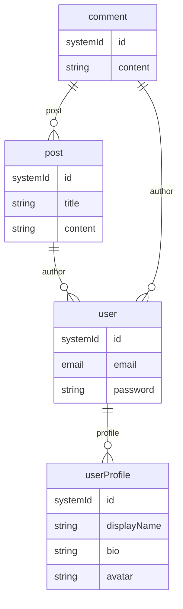

# OSED - Open Standard Entity Description


[](docs/CODE_OF_CONDUCT.md)

Standard description of entities and inter-entity relations defined for a system

# About

This document attempts to standardize machine-readable description of nouns
(entities) and, relations among nouns - applicable to function of a system -
while maintaining high degree of human-readability. The rules specified in this
document collectively form the standard.

**Currently in development for v0.3.0.**

_Note: The README and examples refer to v0.3.0, which is under active
development. The v0.3.0 tag will be added once the release is finalized and all
documentation is coherent._

One obvious use case is the abstraction of database schema definitions. Single
OSED document can be used to generate schema definitions for multiple database
management systems (DBMS) using OSED-compliant parsers. This can be useful for
switching to different DBMS during initial development phase. Extra handling may
be required to attain complete inter-operability. OSED can also be used to
document nouns - with specific semantics within a system - without defining
workflows.

It can be helpful to draft OSED documents, prior to implementation of system
function. OSED documents should be versioned and tracked using version control.
Solutions Architects, Business or Technical Analysts or any individual involved
in translating business requirement into system design may choose to draft an
OSED document.

###### Version 0.3.0

The key words "MUST", "MUST NOT", "REQUIRED", "SHALL", "SHALL NOT", "SHOULD",
"SHOULD NOT", "RECOMMENDED", "NOT RECOMMENDED", "MAY", and "OPTIONAL" in this
document are to be interpreted as described in
[BCP 14](https://www.rfc-editor.org/bcp/bcp14)
[[RFC2119](https://www.rfc-editor.org/rfc/rfc2119)]
[[RFC8174](https://www.rfc-editor.org/rfc/rfc8174)] when, and only when, they
appear in all capitals, as shown here.

# Installation

## From PyPI (Recommended)

```bash
pip install osed
```

## From Source

```bash
git clone https://github.com/osedes/osed.git
cd osed
pip install -e .
```

# Quick Start

## CLI Usage

The `osed` command-line interface provides tooling for validating, linting, and
generating code from OSED documents.

### Subcommands

- `validate` : Validate an OSED document
- `lint` : Lint an OSED document
- `generate` : Generate code from an OSED document
- `diff` : Compare OSED documents or schemas
- `visualize` : Visualize entity relationships
- `completion` : Show or install bash completion script

### Validate an OSED document

```bash
osed validate --file sample/osed.driver.mongoose-mongodb.v0.3.0.yaml
```

### Lint an OSED document

```bash
osed lint --file=sample/osed.driver.mongoose-mongodb.v0.3.0.yaml
```

### Acknowledge or Unacknowledge Lint Warnings

You can acknowledge or unacknowledge linter warnings at either the project or
user (global) config level.

#### Acknowledge a warning (project-level, default):

```bash
osed lint acknowledge --kind sensitiveFields --path file.yaml#Entity.field --user alice
```

#### Acknowledge a warning (user-level/global):

```bash
osed lint acknowledge --kind sensitiveFields --path file.yaml#Entity.field --user alice --global
```

#### Unacknowledge a warning (project-level, default):

```bash
osed lint unacknowledge --kind sensitiveFields --path file.yaml#Entity.field --user alice
```

#### Unacknowledge a warning (user-level/global):

```bash
osed lint unacknowledge --kind sensitiveFields --path file.yaml#Entity.field --user alice --global
```

- The `--global` flag applies the operation to the user config at
  `~/.osed/config.yaml`. Without it, the project config `.osed/config.yaml` is
  used.
- The `--user` argument is for audit trail (who performed the action).
- The `--note` argument is optional and can be used to add context to the
  acknowledgement or unacknowledgement.

### Generate code from an OSED document

Generate Mongoose/TypeScript schema files:

```bash
osed generate \
  --target mongoose \
  --file sample/osed.driver.mongoose-mongodb.v0.3.0.yaml \
  --out ./generated
```

The generate command supports:

- **Mongoose/TypeScript**: Generates TypeScript interfaces and Mongoose schema
  files
- Extensible framework support for future targets (Prisma, SQLAlchemy, etc.)

Generated files include:

- TypeScript interfaces with proper typing
- Mongoose schema definitions with metadata support
- Import/export statements for cross-references
- Support for arrays, maps, references, and nested objects

### Compare OSED documents and schemas

Compare two OSED documents or schema files to identify changes and breaking
changes:

```bash
# Compare two OSED documents
osed diff sample/osed.v0.2.0.yaml sample/osed.v0.3.0.yaml

# Compare two OSED schema files
osed diff schema/osed.schema.v0.2.0.yaml schema/osed.schema.v0.3.0.yaml
```

The diff command provides:

- **Structural Analysis**: Shows added, removed, and modified entities,
  universals, and particulars
- **Breaking Changes Detection**: Identifies changes that could break existing
  code
- **Impact Analysis**: Analyzes impact on generated code (TypeScript, Mongoose,
  migration)
- **Schema Comparison**: Supports comparing both OSED documents and JSON Schema
  files
- **Color-coded Output**: Uses colors for better readability (green for
  additions, red for removals)

Example output:

```
🔍 OSED Document Diff Analysis
==================================================
📄 Comparing: osed.v0.2.0.yaml → osed.v0.3.0.yaml

📋 Structural Changes:
  ✅ Added entities: userProfile, user, comment, post
  ❌ Removed entities: documentDescription, entityDescription, valueDescription
  ✅ Added universals: name, description, contact
  ❌ Removed universals: version, type, value

⚠️  Breaking Changes:
  - Removed entities: documentDescription, entityDescription, valueDescription

🎯 Generated Code Impact:
  Typescript:
    - New interfaces: userProfile, user, comment, post
    - Removed interfaces: documentDescription, entityDescription, valueDescription
  Mongoose:
    - New schemas: userProfile, user, comment, post
    - Removed schemas: documentDescription, entityDescription, valueDescription
  Migration:
    - Remove references to: documentDescription, entityDescription, valueDescription
```

### Visualize Entity Relationships

You can visualize the relationships between entities in your OSED document using
the `osed visualize` command. This supports multiple output formats:

- `graph-easy`: ASCII art for terminal viewing
- `dot`: Graphviz DOT format (for further processing)
- `png`: Bitmap image (requires Graphviz system package)
- `svg`: Scalable Vector Graphics (recommended: best for quality,
  browser-friendly)
- `mermaid`: Markdown-compatible ER diagrams (rendered on GitHub and many tools)
- `plantuml`: UML class diagrams (rendered with PlantUML JAR, server, or online
  editors)

**Recommended:** Use `--format=svg` for the highest quality, scalable diagrams
that work well in browsers and documentation. Use `--format=mermaid` for
Markdown/GitHub rendering. Use `--format=plantuml` to generate UML class
diagrams for use with PlantUML tools.

> **PlantUML rendering:** The generated PlantUML code can be rendered using the
> PlantUML JAR, a local PlantUML server, or online editors such as
> plantuml.com/plantuml. Paste the code into your preferred PlantUML tool to
> visualize the diagram.

#### Example Usage

```bash
# Visualize as ASCII art in the terminal
osed visualize --format=graph-easy --input sample/osed.v0.3.0.yaml

# Generate a Graphviz DOT file
osed visualize \
  --format=dot \
  --input sample/osed.v0.3.0.yaml \
  --output entities.dot

# Generate a PNG image (requires Graphviz installed)
osed visualize \
  --format=png \
  --input sample/osed.v0.3.0.yaml \
  --output entities.png

# Generate an SVG image (recommended)
osed visualize \
  --format=svg \
  --input sample/osed.v0.3.0.yaml \
  --output entities.svg

# Generate a Mermaid ER diagram (for Markdown/GitHub)
osed visualize \
  --format=mermaid \
  --show-types \
  --input tests/data/v0.3.0/osed.visualize-demo.v0.3.0.yaml \
  --output entities.mmd

# Generate a PlantUML UML class diagram
osed visualize \
  --format=plantuml \
  --show-types \
  --input tests/data/v0.3.0/osed.visualize-demo.v0.3.0.yaml \
  --output entities.puml

# (Note: The sample/osed.v0.3.0.yaml file does not currently contain relationships. For a representative example, use tests/data/v0.3.0/osed.visualize-demo.v0.3.0.yaml. The sample file should be updated in the future to include relationships.)
```

#### Example Mermaid Output (text)

```
erDiagram
  user ||--o{ userProfile : profile
  post ||--o{ user : author
  comment ||--o{ post : post
  comment ||--o{ user : author
  userProfile {
    systemId id
    string displayName
    string bio
    string avatar
  }
  user {
    systemId id
    email email
    string password
  }
  post {
    systemId id
    string title
    string content
  }
  comment {
    systemId id
    string content
  }
```

#### Example Mermaid Output (rendered on GitHub)



> **Tip:** SVG is ideal for embedding in documentation, sharing, and zooming
> without loss of quality. Mermaid is ideal for Markdown/GitHub rendering.

### Return Codes

| Code | Meaning                                           |
| ---- | ------------------------------------------------- |
| 0    | Success                                           |
| 1    | Validation, linting, or breaking changes detected |
| 2    | Input file or schema missing                      |

## Logging and Output Formats

All OSED CLI commands support structured, severity-based logging. You can
control the output format using the `--output-format` flag:

- `--output-format human` (default): Human-readable, colorized output for
  interactive use.
- `--output-format json`: Newline-delimited JSON (NDJSON), suitable for machine
  parsing, CI pipelines, and log aggregation.

Each log message includes:

- `severity`: One of `info`, `warning`, `error`, or `critical`
- `message`: Human-readable description
- `timestamp`: ISO8601 timestamp
- (optionally) `context`, `suggestions`, `file_path`

**Example (NDJSON):**

```json
{"severity": "info", "message": "Validation passed", "timestamp": "2025-07-16T14:30:00.000Z"}
{"severity": "warning", "message": "Entity 'user' is missing a required field", "timestamp": "..."}
{"severity": "error", "message": "Schema file not found: schema/osed.schema.v0.3.0.yaml", "timestamp": "..."}
{"severity": "critical", "message": "System out of memory", "timestamp": "..."}
```

**Tip:** Use `--output-format json` for integration with tools, scripts, or CI
systems.

## End-to-End Workflow

This section demonstrates a complete workflow from OSED document to working
application.

## Step 1: Create Your OSED Document

Start with a YAML file describing your entities using the new driver-based
approach:

```yaml
# sample/osed.driver.mongoose-mongodb.v0.3.0.yaml
osed: '0.3.0'
driver: 'mongoose-mongodb' # Optional: specifies the target driver

entities:
  - user
  - post
  - comment
  - userProfile

universals:
  - string
  - number
  - boolean
  - date
  - email
  - password
  - url
  - systemId

particulars:
  - Employee:
      - position
      - department

user:
  id: systemId
  email: email
  password: password
  isActive:
    type: boolean
    default: true
  posts:
    type: list
    items:
      type: reference
      ref: post

post:
  id: systemId
  title: string
  content: string
  author:
    type: reference
    ref: user
    required: true
  tags:
    type: list
    items: string
  metadata:
    type: map
    value: string

comment:
  id: systemId
  content: string

userProfile:
  id: systemId
  displayName: string
  bio: string
  avatar: string
```

## Step 2: Validate and Lint

Ensure your document is valid and follows best practices:

```bash
# Validate the document structure
osed validate --file sample/osed.driver.mongoose-mongodb.v0.3.0.yaml

# Lint for semantic issues and best practices
osed lint --file=sample/osed.driver.mongoose-mongodb.v0.3.0.yaml
```

## Step 3: Generate Code

Generate production-ready TypeScript and Mongoose files:

```bash
# Generate Mongoose/TypeScript schemas
osed generate --target mongoose --file sample/osed.driver.mongoose-mongodb.v0.3.0.yaml --out ./generated
```

This creates:

- `generated/user.model.ts` - User interface and schema
- `generated/post.model.ts` - Post interface and schema
- `generated/index.ts` - Export all models

## Step 4: Build Your Application

### Option A: Use the Provided Server Example

The project includes a complete server example in
`examples/mongoose-mongo-server/`:

```bash
# Copy your generated files to the example
cp generated/* examples/mongoose-mongo-server/src/models/

# Navigate to the example
cd examples/mongoose-mongo-server

# Install dependencies
npm install

# Start MongoDB (any running instance)
# You can use MongoDB Atlas (cloud), local MongoDB, or any MongoDB instance
# The server will connect to mongodb://localhost:27017 by default

# Start the server
npm run dev
```

### Option B: Integrate with Your Own Application

```typescript
// app.ts
import express from 'express';
import mongoose from 'mongoose';
import { User, Post } from './generated';

const app = express();
app.use(express.json());

// Connect to MongoDB
mongoose.connect('mongodb://localhost:27017/myapp');

// Use generated models in your routes
app.get('/users', async (req, res) => {
  const users = await User.find().populate('posts');
  res.json(users);
});

app.post('/users', async (req, res) => {
  const user = new User(req.body);
  await user.save();
  res.status(201).json(user);
});

app.listen(3000, () => {
  console.log('Server running on port 3000');
});
```

## Step 5: Test Your Application

Use the provided test script or create your own tests:

```bash
# Test the server endpoints
./examples/mongoose-mongo-server/test_endpoints.sh

# Or test specific endpoints
./examples/mongoose-mongo-server/test_endpoints.sh \
  --ip localhost \
  --port 3000 \
  --user-id 123
```

## Complete Example

See `examples/mongoose-mongo-server/` for a complete, production-ready server
that demonstrates:

- ✅ TypeScript with ES modules
- ✅ Express.js with proper routing
- ✅ Mongoose models with validation
- ✅ Complete CRUD operations
- ✅ Health check endpoints
- ✅ Error handling and logging
- ✅ MongoDB setup (any MongoDB instance)
- ✅ Comprehensive testing script

## Workflow Benefits

1. **Single Source of Truth**: Your OSED document defines both data structure
   and relationships
2. **Type Safety**: Generated TypeScript interfaces ensure compile-time type
   checking
3. **Consistency**: All generated code follows the same patterns and conventions
4. **Maintainability**: Changes to the OSED document automatically update all
   generated code
5. **Validation**: Built-in validation ensures data integrity at multiple levels
6. **Documentation**: The OSED document serves as living documentation for your
   data model

# Developer Documentation

All documentation is available in the [`docs/`](docs/) directory:

- **[CHANGELOG.md](docs/CHANGELOG.md)** - Complete version history and changes
- **[CONTRIBUTING.md](docs/CONTRIBUTING.md)** - Contribution guidelines and
  development process
- **[CODE_OF_CONDUCT.md](docs/CODE_OF_CONDUCT.md)** - Community standards and
  behavior expectations
- **[DEVELOPMENT.md](docs/DEVELOPMENT.md)** - Development guide, CI/CD, and
  technical setup
- **[RELEASE_CHECKLIST.md](docs/RELEASE_CHECKLIST.md)** - Step-by-step release
  process

For developers contributing to OSED:

- **[Getting Started](docs/CONTRIBUTING.md#getting-started)** - How to set up
  your development environment
- **[Development Guidelines](docs/CONTRIBUTING.md#development-guidelines)** -
  Code style, testing, and documentation standards
- **[Pull Request Process](docs/CONTRIBUTING.md#pull-request-process)** - How to
  submit and review changes
- **[Issue Reporting](docs/CONTRIBUTING.md#issue-reporting)** - How to report
  bugs and request features
- **[CI/CD Pipeline](docs/DEVELOPMENT.md#cicd-pipeline)** - GitHub Actions
  workflows and local development
- **[Code Quality](docs/DEVELOPMENT.md#code-quality)** - Linting, formatting,
  and testing guidelines
- **[Package Management](docs/DEVELOPMENT.md#package-management)** - PyPI
  publishing and emergency procedures
- **[Project Structure](docs/DEVELOPMENT.md#project-structure)** - Repository
  layout and directory overview

# Advanced Usage

## Schema Validation and Linting

OSED provides comprehensive validation and linting to ensure schema correctness
and consistency. The linter performs semantic analysis of entity references and
structure validation.

### Entity Reference Extraction Logic

The linter uses a context-sensitive approach to extract entity references:

#### What Gets Collected as "Used Entities":

1. **Top-level keys** (excluding reserved control keys):
   - Any top-level key that's not `osed`, `entities`, `universals`, or
     `particulars` is considered an entity declaration
   - These must be declared in the `entities`, `universals`, or `particulars`
     sections

2. **Leaf node values** (strings that are not property names):
   - String values that appear as direct values in entity descriptions
   - Values of `mongoose:ref` and `mongoose:items` fields
   - Any string value that represents an entity reference

#### What Does NOT Get Collected:

- **Property names** (non-top-level keys): These are field names, not entity
  references
- **Metadata keys**: Keys like `mongoose:type`, `mongoose:required`, etc.

#### Linting Rules:

- **Undeclared entities**: Any top-level key or leaf node value not found in
  `entities`, `universals`, or `particulars` is reported as undeclared
- **Unknown top-level keys**: Top-level keys that aren't declared entities are
  reported as unknown
- **Unused entities**: Entities declared but not used anywhere are reported as
  unused

#### Example Linting Output:

```bash
✅ All required keys are present.
✅ All entity names are valid.
✅ No duplicate entities across entities/universals/particulars.
⚠️  Undeclared but used entities:
  - string      # Leaf node value not declared
  - systemId    # Leaf node value not declared
✅ All declared entities are used.
✅ No unknown top-level keys.
```

### Driver-Based Metadata: Embedding vs Referencing

OSED supports both embedded sub-documents and references in Mongoose/MongoDB
schema generation using the new driver-based approach. The convention and linter
behavior are as follows:

#### Embedding (Sub-Document)

If you use a direct entity name under `items` or `value`, the field will be
treated as an embedded sub-document.

Example:

```yaml
osed: '0.3.0'
entities:
  - Task
  - Project

universals:
  - string
  - systemId

particulars:
  - Employee:
      - position
      - department

Task:
  id: systemId
  name: string
  description: string

Project:
  id: systemId
  name: string
  tasks:
    type: list
    items: Task # Embedded sub-document
```

ℹ️ The linter will print:

> Embedding entity 'Task' as a sub-document at ... For referencing, use 'type:
> list' with 'items: {type: reference, ref: Task}'.

#### Referencing (Foreign Key)

If you want to create a reference to another collection, use the explicit
type+ref pattern:

Example:

```yaml
osed: '0.3.0'
entities:
  - Task
  - Project

universals:
  - string
  - systemId

particulars:
  - Employee:
      - position
      - department

Task:
  id: systemId
  name: string
  description: string

Project:
  id: systemId
  name: string
  tasks:
    type: list
    items:
      type: reference
      ref: Task # Reference to another collection
```

ℹ️ The linter will print:

> Referencing entity 'Task' at ... For embedding, use 'items: Task' (direct
> entity name) instead of type+ref.

#### Summary Table

| Pattern                               | Treated As | Linter Output                      |
| ------------------------------------- | ---------- | ---------------------------------- |
| `items: Task`                         | Embedded   | Info: Embedding entity 'Task'...   |
| `items: {type: reference, ref: Task}` | Reference  | Info: Referencing entity 'Task'... |

#### Notes

- Embedding is best for small, tightly coupled data.
- Referencing is best for large, independent, or shared data.
- The linter provides informative messages to help you choose the right
  approach.
- See MongoDB and Mongoose documentation for more on embedding vs referencing
  best practices.

## Document and Schema Comparison

The `osed diff` command provides comprehensive comparison capabilities for both
OSED documents and schema files, helping you understand changes and their
impact.

### Document Comparison

Compare two OSED documents to identify structural changes:

```bash
osed diff sample/osed.v0.2.0.yaml sample/osed.v0.3.0.yaml
```

**What Gets Compared:**

- **Entities**: Added, removed, and modified entity definitions
- **Universals**: Changes to common nouns and their structure
- **Particulars**: Changes to system-specific nouns
- **Schema Version**: OSED specification version changes
- **Driver Changes**: Target driver specification changes

**Breaking Changes Detection:**

- Removed entities that could break existing code
- Removed fields from existing entities
- Type changes (simple to complex or vice versa)

**Impact Analysis:**

- **TypeScript**: New/removed interfaces and field changes
- **Mongoose**: New/removed schemas and field changes
- **Migration**: Required changes to existing code

### Schema Comparison

Compare two OSED schema files to understand validation rule changes:

```bash
osed diff schema/osed.schema.v0.2.0.yaml schema/osed.schema.v0.3.0.yaml
```

**What Gets Compared:**

- **Properties**: Added, removed, and modified schema properties
- **Definitions**: Changes to JSON Schema definitions
- **Schema Version**: Schema specification version changes

**Impact Analysis:**

- **Validation**: New required properties and validation rules
- **Compatibility**: New definitions and type changes
- **Migration**: Required updates to existing documents

### Comparison Types

The diff command automatically detects the type of files being compared:

- **OSED Documents**: Files with `entities`, `universals`, `particulars`
  sections
- **Schema Files**: Files with `$schema`, `$id`, or `definitions` sections
- **Mixed Comparison**: Error if trying to compare document with schema

### Output Format

The diff output uses color-coded formatting for better readability:

- **Green (✅)**: Additions (new entities, universals, properties)
- **Red (❌)**: Removals (deleted entities, universals, properties)
- **Yellow (🔄)**: Modifications (changed fields, types)
- **Red (⚠️)**: Breaking changes (removed entities, required fields)

### Use Cases

**Version Migration:**

```bash
# Compare old and new versions to understand migration needs
osed diff sample/osed.v0.2.0.yaml sample/osed.v0.3.0.yaml
```

**Schema Evolution:**

```bash
# Compare schema changes to understand validation updates
osed diff schema/osed.schema.v0.2.0.yaml schema/osed.schema.v0.3.0.yaml
```

**Breaking Change Detection:**

```bash
# Check if changes will break existing code
osed diff current.yaml proposed.yaml
# Exit code 1 indicates breaking changes detected
```

## Code Generation Output

The `osed generate` command produces production-ready TypeScript and Mongoose
files from OSED documents.

### Generated File Structure

For each entity in your OSED document, the following files are generated:

```
generated/
├── user.model.ts      # User entity interface and schema
├── post.model.ts      # Post entity interface and schema
└── index.ts           # Export all models
```

### TypeScript Interface Example

```typescript
// user.model.ts
import { Document, Schema, model } from 'mongoose';

export interface IUser extends Document {
  id: string;
  name: string;
  email: string;
  isActive: boolean;
  profile?: {
    displayName: string;
    xp: number;
  };
  posts?: Array<Schema.Types.ObjectId | IPost>;
}

const userSchema = new Schema<IUser>({
  id: { type: String, required: true },
  name: { type: String, required: true },
  email: { type: String, required: true, unique: true },
  isActive: { type: Boolean, default: true },
  profile: {
    displayName: { type: String },
    xp: { type: Number },
  },
  posts: [{ type: Schema.Types.ObjectId, ref: 'Post' }],
});

export const User = model<IUser>('User', userSchema);
```

### Supported Features

- **Primitive Types**: `string`, `number`, `boolean`, `date`
- **Arrays**: `type: list` with `items`
- **Maps**: `type: map` with `value`
- **References**: Cross-entity relationships with `type: reference` and `ref`
- **Metadata**: `required`, `unique`, `default` values
- **Nested Objects**: Embedded sub-documents
- **Import/Export**: Automatic dependency management
- **Driver Support**: Mongoose/MongoDB (extensible to other drivers)

### Metadata Support

Driver metadata is applied to generated schemas:

```yaml
osed: '0.3.0'
entities:
  - user

universals:
  - string
  - boolean
  - email
  - systemId

user:
  id: systemId
  email:
    type: string
    required: true
    unique: true
  isActive:
    type: boolean
    default: true
```

Generates:

```typescript
email: { type: String, required: true, unique: true },
isActive: { type: Boolean, default: true }
```

# Reference

## Specification

All text in an OSED document MUST adhere to specifications defined in this
section. OSED documents are presented using [YAML](https://yaml.org/). A YAML
node containing the structure of an entity is a `Description`(`description`), in
the context of an OSED document.

### Semantic Node

A **semanticNode** is a recursive structure used in both
[`universals`](#universals) and [`particulars`](#particulars). Each
**semanticNode** MUST be one of:

- A string
- A dictionary (map) with **exactly one** key-value pair, where:
  - The key MUST be a string
  - The value MUST be a list of **semanticNode**s

This structure allows arbitrarily nested maps with meaningful names, but does
**not permit unnamed lists**, or maps with more than one key. This enables
forming named groups of nouns while ensuring semantic clarity and simplicity.

### Top level entry

A top level entry is an entry in OSED document that is not nested inside any
other entry. It can however be referenced from nested locations. Each top level
entry MUST either be an [`entityDescription`](#entity-description) or a
key-value pair with one of four reserved words as the key. The words
[`osed`](#osed), [`entities`](#entities), [`universals`](#universals) and
[`particulars`](#particulars) are reserved in OSED and have special meaning.
These SHOULD NOT be part any [`entityDescription`](#entity-description).

| Reserved word | Type   | Required | Notes                          |
| ------------- | ------ | -------- | ------------------------------ |
| `osed`        | string | Yes      | Version of the schema (SemVer) |
| `entities`    | list   | Yes      | List of entity names           |
| `universals`  | list   | No       | Common nouns, not described    |
| `particulars` | list   | No       | Specific nouns, not described  |

#### `osed`

REQUIRED. `osed` field contains OSED version (string), the encompassing document
conforms to. It follows [SemVer](https://semver.org/). This field ideally should
be the first entry in an OSED document.

#### `entities`

REQUIRED. MUST be a list of nouns/entities (strings) described in this document.
There

- MUST be a top level `description` in an OSED document or
- MUST be a leaf node with the same name in the `particulars` list or
- MUST be a leaf node with the same name in the `universals` list,

for each entry in `entities` list; checked in that order. An entry in this list
is an entity.

#### `universals`

OPTIONAL. `universals` are nouns with valid semantics, both inside and outside
of a system. `universals` are listed but not described. If present, `universals`
MUST be a list. Each item in the list MUST be a
[**semanticNode**](#semantic-node). There MUST NOT be any top level entry with
one of the `universals` as key. e.g. password, email etc.

✅ Valid example:

```yaml
universals:
  - email
  - password
  - contact:
      - phone
      - email
  - identity:
      - aadhaar
      - pan
```

❌ Invalid examples:

```yaml
universals:
  - [email, password] # ❌ Unnamed list (not a semanticNode)

  - auth:
      method: string # ❌ Map value must be a list of semanticNodes

  - misc:
      - phone: # ❌ Map inside a list with multiple keys is invalid
          - home
          - work
        email:
          - personal
          - work
```

#### `particulars`

OPTIONAL. `particulars` are words with specific semantics within a system.
`particulars` are listed but not described. If present, `particulars` MUST be a
list. Each item in the list MUST be a [**semanticNode**](#semantic-node). There
MUST NOT be any top-level entry with one of the `particulars` as key. e.g.
`osed`, `entities`, `universals` in OSED etc. The structure is identical to
`universals`.

### Entity Description

REQUIRED, at least one in each OSED document. Each entityDescription defines an
entity in the system. It consists of a map with exactly one key-value pair,
where:

- The key is the name of the entity (a string).
- The value MUST be either:
  - a [`valueDescription`](#value-description), or
  - a flat list of strings, intended to represent categories, enumerated values,
    or labels.

### Value Description

A `valueDescription` is a map where:

- Each key MUST be a string.
- Each value MUST be one of:
  - a `particular`
  - a `universal`
  - an entity
  - another valueDescription

This recursive structure allows nesting and composition of values using
meaningful names.

❌ A valueDescription MUST NOT be a list, scalar, or dictionary with non-string
keys.

❌ Special constructs like type: list and type: map are not part of the core
spec and are instead handled by downstream metadata.

## Examples

```yaml
osed: '0.3.0'
entities:
  - user
  - taskLabel

universals:
  - string
  - integer
  - email
  - password
  - systemId

user:
  id: systemId
  email: email
  password: password
  profile:
    displayName: string
    xp: integer

taskLabel:
  - personalCare
  - career
  - shopping
  - custom
```

[sample/osed.v0.3.0.yaml](sample/osed.v0.3.0.yaml) is a minimal example of a
YAML document conforming to OSED version 0.3.0.

# Authors

- name: Jitendra Marndi
- email: quantumtunneler@duck.com
- github: [jitmar](https://github.com/jitmar)
